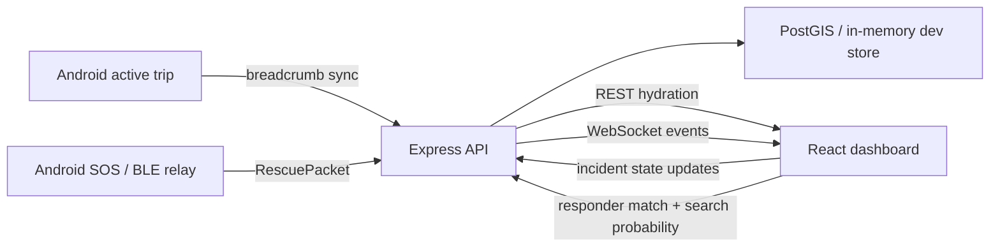
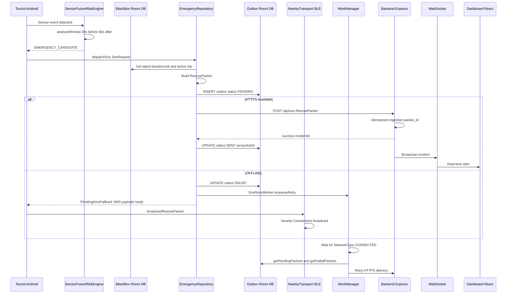
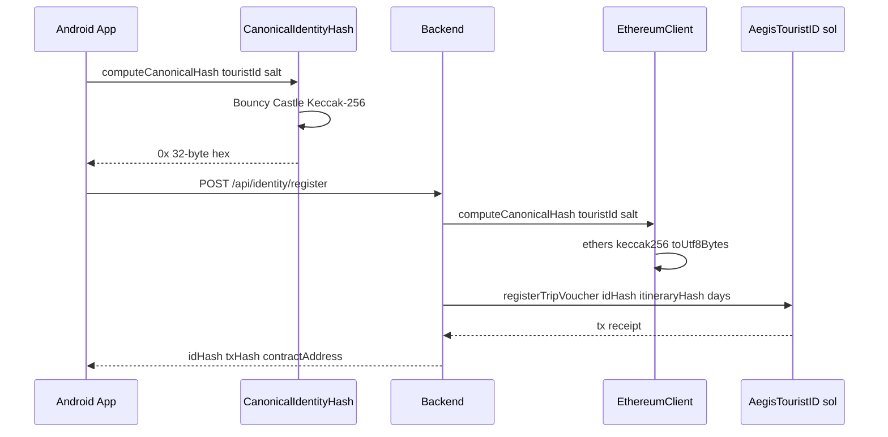
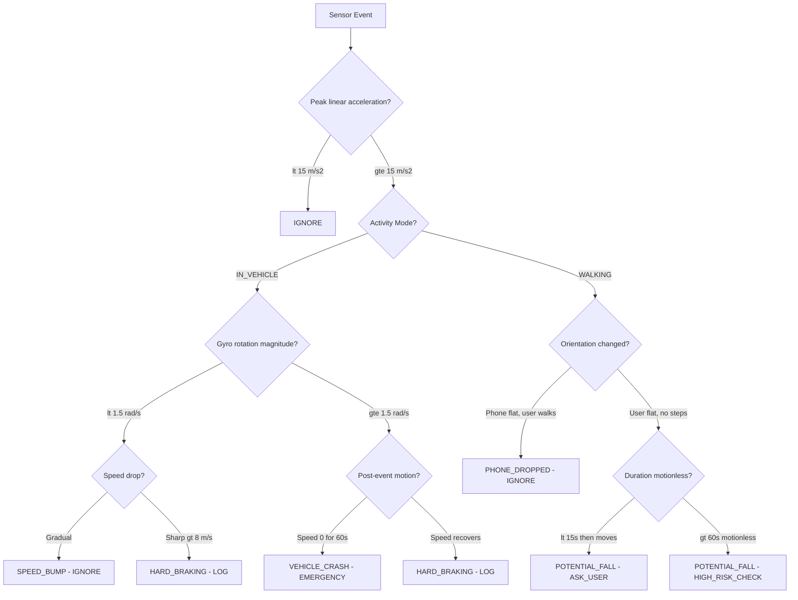
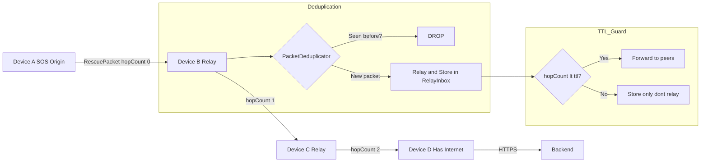

# AEGIS Architecture — Data Flow & Component Interactions

## Authority Dashboard User Tracking Plan

The web command center should become the operator-facing live tracking surface for active tourist trips and emergency incidents. Tracking is bounded to active trip monitoring and emergency response, and all UI/API contracts remain privacy-first: raw PII stays off the dashboard and off-chain.

Dashboard operational layers:

| Layer | Source | Dashboard usage |
|---|---|---|
| Active subjects | `GET /api/trips` plus latest breadcrumb | Show every monitored active trip, not only SOS cases. |
| Breadcrumb trail | `GET /api/breadcrumbs/:tripId` | Render selected trip BlackBox trajectory. |
| Incidents | `GET /api/incidents` and `EMERGENCY_SOS` | Show emergency markers and state machine actions. |
| Geofences | `GET /api/geofences` | Render safe, caution, and high-risk polygons. |
| Hazards | `GET /api/hazards` and hazard events | Show reported or confirmed route risks. |
| Responders | `GET /api/responders` and `POST /api/responders/match` | Show available units and recommended dispatch. |
| Search sectors | `POST /api/search-probability` | Estimate likely search sectors from last-known telemetry. |

The detailed implementation plan is maintained in `docs/superpowers/plans/2026-08-14-web-dashboard-user-tracking.md`.

## SOS Emergency Flow

## Identity Registration Flow

## Sensor Fusion Decision Tree

## BLE Mesh Relay Protocol

## Database Schema - Android Room

| Entity | Primary Key | Key Fields |
|---|---|---|
| TripEntity | tripId | touristId, startedAt, endedAt, status |
| BreadcrumbEntity | breadcrumbId | tripId, lat, lon, accuracy, altitude, speed, bearing, battery, activityMode |
| SensorEventChunkEntity | chunkId | tripId, eventType, confidence, startTime, endTime, jsonPayload |
| OutboxEntity | packetId | eventType, payloadJson, status, attemptCount, serverAckId |
| CheckInEntity | id | touristId, zoneId, lat, lon, checkedInAt |
| RelayPacketEntity | packetId | originTouristId, payload, receivedAt, forwarded |
| SafetyZoneEntity | zoneId | name, riskLevel, coordinatesJson |

## Database Schema - Backend PostgreSQL PostGIS

| Table | Geometry Column | Purpose |
|---|---|---|
| tourists | — | Pseudonymous identity records id_hash no PII |
| trips | — | Active and completed trip sessions |
| breadcrumbs | location POINT | GPS trail with battery and accuracy |
| incidents | location POINT | SOS events with idempotent packet_id |
| incident_events | — | Audit trail JSONB payload |
| check_ins | location POINT | Periodic safety confirmations |
| hazard_reports | location POINT | Crowd-sourced hazard intelligence |
| safety_zones | boundary POLYGON | Geofence risk classification |
| responder_units | location POINT | Rescue team positions |
| responder_capabilities | — | Equipment and skill per responder |
| relay_packet_receipts | — | BLE mesh relay audit |
