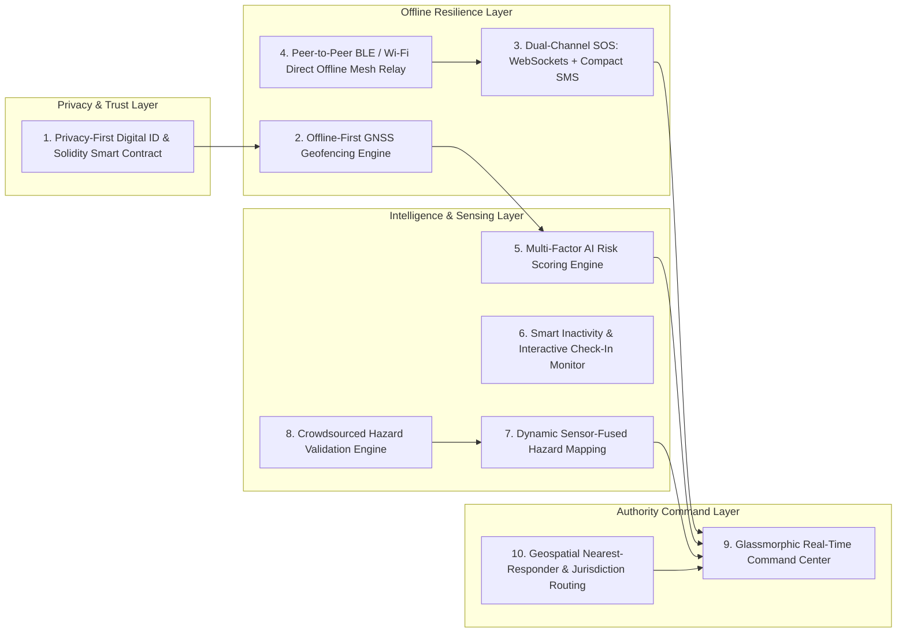

# AEGIS — Master Technical Plan & Product Architecture
**Smart Tourist Safety Monitoring, Offline Mesh Incident Response & Blockchain Digital ID System**

---

## Executive Overview & Project Identity

**Project Name**: **AEGIS** (Autonomous Emergency & Geospatial Identity Safeguard)  
**Target Event**: 24-Hour Hackathon  
**Core Mission**: Provide end-to-end tourist safety, privacy-preserving digital identity, on-device offline geofencing, multi-hop peer-to-peer emergency mesh signaling, and real-time authority incident dispatch in extreme or zero-connectivity environments.

> [!IMPORTANT]
> **Zero-Cost Constraint Enforced**: Every component of AEGIS is designed using 100% free, open-source, or public testnet infrastructure (Solidity on Ethereum Sepolia / Polygon Amoy testnet, OpenStreetMap + Leaflet/MapLibre GL, native Android BLE/Wi-Fi Direct, local Room SQLite DB, Node.js + free tier Supabase). No paid APIs (such as Twilio, Google Maps Platform paid tiers, or commercial SMS gateways) will be used.

---

## 🌟 Top 10 High-Impact Differentiating Features

---

### Feature 1: Privacy-Preserving Blockchain Digital Tourist ID (Solidity Smart Contract)
* **What it does**: Issues a temporary, cryptographic tourist identity voucher valid strictly for the duration of a trip (e.g. 7 days).
* **Why it differentiates**: Prevents state surveillance while guaranteeing tamper-proof verification. Personal PII (Passport, Aadhaar, phone) stays encrypted on-device. Only cryptographic hashes (`sha256(TouristID + Salt + Expiry)`) and status vouchers are committed to the public blockchain.
* **On-Chain Contract Specs**: Written in **Solidity**, deployed on Ethereum Sepolia or Polygon Amoy Testnet (0 cost via faucets). Contains functions `registerTrip()`, `verifyID()`, `revokeID()`, and `autoExpire()`.
* **QR Verification**: Homestays, police checkpoints, and tour guides scan an auto-refreshing offline QR code to verify validity without viewing raw PII.

---

### Feature 2: On-Device Offline-First GNSS Geofencing Engine
* **What it does**: Computes exact geospatial polygon intersections locally on the phone using standard GPS (GNSS) satellites—functioning seamlessly with **zero internet or cellular connectivity**.
* **Why it differentiates**: Most safety apps rely on server-side geofencing. AEGIS downloads spatial vector tiles into a local Room SQLite spatial index.
* **Technical Mechanism**: Ray-casting algorithm evaluates current `(lat, lon)` against polygon boundaries for Safe 🟢, Caution 🟡, and High Risk 🔴 zones every 30 seconds locally on the phone. Instant local push alert fires when entering danger zones.

---

### Feature 3: Resilient Dual-Channel SOS (WebSockets + Zero-Cost Compact Payload)
* **What it does**: A single-tap emergency SOS button that instantly locks location, battery %, timestamp, tourist ID, emergency contacts, and last known trajectory.
* **Why it differentiates**: Dual-path routing ensures the message gets out under any connectivity state.
* **Network Path**: If data is available, sends raw JSON over WebSockets/HTTPS.
* **Zero-Cost Fallback**: If mobile data is down but basic voice cell towers exist, formats an ultra-compact Base64 string payload (`SOS:ID|LAT|LON|BAT|TIME`) for transmission via Android Native SMS Intent to authority numbers—incurring $0 API fees.

---

### Feature 4: Peer-to-Peer Offline Mesh Relay Network (Bluetooth LE / Wi-Fi Direct)
* **What it does**: In total dead zones (no cell towers, no internet), an SOS alert generated by Tourist A hops wirelessly across nearby tourists' phones (Tourist A $\rightarrow$ Tourist B $\rightarrow$ Tourist C) until reaching a device that has network access to forward the alert to the backend.
* **Why it differentiates**: This is a cutting-edge research feature that elevates AEGIS from a simple app to a resilient survival network.
* **Technical Specs**: Android Nearby Connections API using Bluetooth Low Energy (BLE) and Wi-Fi Aware. Store-and-forward TTL (Time-To-Live) packet relay with cryptographic payload signing.

---

### Feature 5: Multi-Factor AI Risk Scoring & Anomaly Detection
* **What it does**: Evaluates movement telemetry to dynamically calculate a continuous **Risk Score (0–100+)** instead of firing false-positive binary alerts.
* **Risk Score Formula**:
  $$\text{Risk Score} = w_1(\text{Route Deviation}) + w_2(\text{Inactivity}) + w_3(\text{Zone Risk}) + w_4(\text{Unanswered Checkin}) + w_5(\text{SOS})$$
* **Thresholds**:
  * **0–30**: Normal (Green)
  * **31–60**: Caution / Interactive Prompt (Yellow)
  * **61–89**: Control Room Advisory Alert (Orange)
  * **90+**: Emergency Responder Dispatch Trigger (Red)

---

### Feature 6: Smart Inactivity & Interactive Check-In Monitor
* **What it does**: Detects prolonged lack of movement (via accelerometer & GNSS) while inside high-risk or caution zones.
* **Why it differentiates**: Prevents false alarms when tourists are sleeping or inside buildings while catching true immobility (e.g. falls, medical collapse).
* **Workflow**: Fires a 2-stage local countdown ("We noticed no movement for 45 mins in a high-risk zone. Are you safe?"). Options: `[I'M SAFE]` or `[NEED HELP]`. Unanswered countdown automatically escalates the Risk Score.

---

### Feature 7: Dynamic Sensor-Fused Hazard Mapping
* **What it does**: Geofence danger polygons are not static maps; they dynamically shrink, expand, or elevate risk levels based on real-time sensor feeds (weather alerts, heavy rainfall, river levels, landslide reports).
* **Technical Specs**: GeoJSON spatial layer server updates hazard weights. Local app synchronizes delta changes when online, updating local Room DB polygon boundaries.

---

### Feature 8: Crowdsourced Hazard Reporting & Multi-Signal Validation
* **What it does**: Tourists and verified guides can drop geotagged reports of active hazards (e.g., collapsed bridge, flash flood, fallen tree).
* **Confidence Engine**: A single report displays as "Unverified Caution". When $\ge 3$ distinct verified Tourist IDs report hazards in a 500m radius within 2 hours, the system automatically escalates the polygon to High Risk and updates all nearby tourist maps.

---

### Feature 9: Glassmorphic Real-Time Authority Command Center
* **What it does**: A ultra-sleek, dark-mode command dashboard for police, mountain rescue, and disaster management operators.
* **UI Features**: Real-time Leaflet/MapLibre map with open-source OpenStreetMap vector tiles, animated SOS ping markers, tourist risk heatmaps, live telemetry streams, and incident management drawers.

---

### Feature 10: Geospatial Nearest-Responder & Jurisdiction Routing
* **What it does**: When an SOS or High Risk incident occurs, AEGIS runs a spatial optimization query to identify the optimal rescue unit (Police, Medical, Search & Rescue) based on distance, terrain difficulty, and availability.
* **Jurisdiction Engine**: Automatically detects district/state administrative boundaries from GPS coordinates and routes alerts to the exact local authority without requiring manual routing choices.

---

## 🎨 Comprehensive UI/UX Design Specifications

### 📱 1. AEGIS Tourist Mobile App (Android Jetpack Compose)
* **Design Aesthetic**: Dark mode primary (`#0F172A`), electric cyan accents (`#06B6D4`), emergency crimson (`#EF4444`), neon amber warning (`#F59E0B`), glassmorphic containers (`rgba(30, 41, 59, 0.7)` with blur).

### 💻 2. AEGIS Authority Command Center (Web App Dashboard)
* **Design Aesthetic**: Command & Control center UI, deep slate background (`#0B0F19`), translucent card panels with subtle glowing borders, live pulsating map markers.

---

## 🛠 100% Free / Open-Source Tech Stack Strategy

| Layer | Component | Open-Source Technology | Cost |
| :--- | :--- | :--- | :--- |
| **Mobile Client** | Android App | Kotlin + Jetpack Compose | **$0** |
| **Local Database** | Offline Storage | Room DB (SQLite Spatial) | **$0** |
| **P2P Mesh** | Dead-Zone Relay | Android Nearby Connections (BLE/Wi-Fi Direct) | **$0** |
| **Smart Contract** | On-Chain Proofs | Solidity on Ethereum Sepolia / Polygon Amoy | **$0 (Testnet)** |
| **Backend Service**| REST/WebSockets | Node.js + Express + Supabase (Free Tier) | **$0** |
| **Geospatial Engine**| Spatial Queries | PostGIS / Turf.js | **$0** |
| **Mapping UI** | Maps & Tiles | Leaflet / MapLibre GL + OpenStreetMap Tiles | **$0** |
