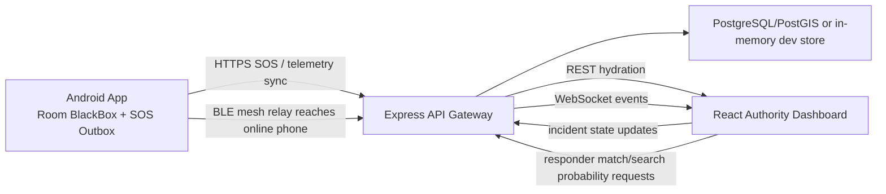

# Web Dashboard User Tracking Implementation Plan

> **For agentic workers:** REQUIRED SUB-SKILL: Use superpowers:subagent-driven-development to execute this plan.

## Goal

Build the AEGIS authority web dashboard into a live operations console that can monitor active tourists/trips, inspect last-known location and breadcrumb trails, respond to SOS incidents, view hazards/geofences/responders, and coordinate search actions without storing or exposing raw PII.

The dashboard must track only safety-relevant, pseudonymous operational state: `touristId`, `idHash`, `tripId`, current/last-known location, timestamp, accuracy, battery, route/risk state, incident status, responder status, and BlackBox breadcrumb history. It must not display passport numbers, Aadhaar numbers, phone numbers, or private identity documents.

## Current Baseline

- `aegis-dashboard` is React 18 + Vite with Leaflet, React Leaflet, and lucide-react already installed.
- `aegis-dashboard/src/api.js` already wraps incidents, geofences, hazards, responders, trips, breadcrumbs, identity verification, and search probability.
- `aegis-dashboard/src/App.jsx` already has a single-screen command center with REST hydration, WebSocket reconnect, incident state transitions, responder matching, and trajectory rendering.
- `aegis-backend/src/websocket/wsServer.js` broadcasts typed events to connected dashboard clients.
- Backend repositories currently provide dev fixtures for active trips and breadcrumbs when PostgreSQL has no rows.

## Architecture



## Tracking Data Contract

Use a single normalized dashboard subject model in the frontend, even when the backend returns separate incidents, trips, and breadcrumbs.

```js
{
  subjectId: "trip:TRIP-2026-MEGHALAYA",
  tripId: "TRIP-2026-MEGHALAYA",
  touristId: "TST-8F29X4",
  idHash: "0x...",
  incidentId: "INC-...",
  status: "ACTIVE" | "CAUTION" | "SOS" | "SEARCHING" | "RESOLVED" | "STALE",
  lat: 25.145,
  lon: 91.265,
  accuracyMeters: 6,
  batteryPercent: 85,
  lastSeenAt: "2026-08-14T10:00:00.000Z",
  plannedRouteId: "cherrapunji-ridge",
  currentZoneId: "zone-dawki-bridge",
  riskScore: 72,
  source: "GPS" | "SMS" | "BLE_RELAY" | "FIXTURE",
  isStale: false
}
```

Frontend stale logic:

- `LIVE`: latest breadcrumb age <= 2 minutes.
- `RECENT`: > 2 minutes and <= 10 minutes.
- `STALE`: > 10 minutes or unknown.
- `EMERGENCY_STALE`: stale subject with open incident or high risk score.

## Implementation Tasks

### 1. Split Dashboard Into Operational Modules

Files:

- `aegis-dashboard/src/App.jsx`
- `aegis-dashboard/src/api.js`
- `aegis-dashboard/src/components/LiveOperationsMap.jsx`
- `aegis-dashboard/src/components/SubjectList.jsx`
- `aegis-dashboard/src/components/SubjectDetailPanel.jsx`
- `aegis-dashboard/src/components/IncidentTimeline.jsx`
- `aegis-dashboard/src/components/ResponderPanel.jsx`
- `aegis-dashboard/src/components/ConnectionStatus.jsx`
- `aegis-dashboard/src/state/dashboardReducer.js`
- `aegis-dashboard/src/state/dashboardSelectors.js`

Work:

1. Keep `App.jsx` as orchestration only: hydration, WebSocket lifecycle, selected subject state, and layout.
2. Move map rendering into `LiveOperationsMap.jsx`.
3. Move incident/user list into `SubjectList.jsx`.
4. Move selected user/trip/incident detail UI into `SubjectDetailPanel.jsx`.
5. Move incident state history and action buttons into `IncidentTimeline.jsx`.
6. Move responder matching and recommended responder details into `ResponderPanel.jsx`.

Acceptance:

- The first screen is the command dashboard, not a landing page.
- The map remains visible above the fold on desktop.
- The dashboard remains usable if the backend is offline, with clear disconnected/error states and no crashes.

### 2. Normalize REST Hydration State

Files:

- `aegis-dashboard/src/api.js`
- `aegis-dashboard/src/state/dashboardReducer.js`
- `aegis-dashboard/src/state/dashboardSelectors.js`

Work:

1. Fetch active trips, incidents, geofences, hazards, responders, and health in parallel.
2. For each active trip, request its latest breadcrumb trail through `GET /api/breadcrumbs/:tripId`.
3. Build normalized maps keyed by ID: subjects, incidents, trips, breadcrumbs, hazards, and responders.
4. Derive `selectedSubject` from normalized state instead of storing duplicated objects in many React state variables.
5. Mark fixture/default data as `source: "FIXTURE"` when the backend returns fixture-looking rows, so the UI can label demo data honestly.

Acceptance:

- Active tourists/trips show even when no SOS incident exists.
- Selecting a trip without an incident still displays latest location, battery, accuracy, last seen time, and route.
- Selecting an incident joins incident data with its trip trail when `tripId` is available.

### 3. Expand WebSocket Event Handling

Files:

- `aegis-backend/src/websocket/wsServer.js`
- `aegis-dashboard/src/state/dashboardReducer.js`
- `aegis-dashboard/src/App.jsx`
- backend controllers/services that mutate operational state

Work:

1. Keep existing events supported: `CONNECTED`, `EMERGENCY_SOS`, `INCIDENT_STATUS_CHANGED`, and `HAZARD_EVALUATED`.
2. Add or document dashboard reducer handling for `TRIP_UPDATED`, `BREADCRUMB_RECORDED`, `RESPONDER_UPDATED`, `GEOFENCE_UPDATED`, and `SEARCH_PROBABILITY_UPDATED`.
3. Include `timestamp` in every event and ignore events that are older than the currently stored record.
4. Keep reconnect with backoff and show `LIVE`, `RECONNECTING`, or `OFFLINE` in the UI.

Acceptance:

- A new SOS appears on the map and subject list without manual refresh.
- A new breadcrumb moves the subject marker and extends the trail without wiping selected UI state.
- Duplicate packet/event IDs do not duplicate incidents or breadcrumbs.

### 4. Build The Live Operations Map

Files:

- `aegis-dashboard/src/components/LiveOperationsMap.jsx`
- `aegis-dashboard/src/App.css`
- `aegis-dashboard/public/icons.svg` if reusable marker symbols are needed

Work:

1. Render OpenStreetMap tiles through Leaflet only.
2. Render active tourist/trip markers, SOS markers, breadcrumb polylines, geofence polygons, hazards, responder units, and search probability sectors.
3. Use marker color and icon shape to distinguish normal, caution, SOS, stale, responder, and hazard states.
4. Add map controls for layer toggles.
5. Fit bounds to selected subject when chosen, but do not fight the operator while they are panning.

Acceptance:

- Operators can see every active tracked tourist/trip, not only emergency incidents.
- A stale location is visually different from a live location.
- The selected user's breadcrumb path is visible with timestamped latest point.

### 5. Build Operator Detail And Action Panels

Files:

- `aegis-dashboard/src/components/SubjectDetailPanel.jsx`
- `aegis-dashboard/src/components/IncidentTimeline.jsx`
- `aegis-dashboard/src/components/ResponderPanel.jsx`
- `aegis-dashboard/src/api.js`

Work:

1. Show pseudonymous identity only: `touristId`, `idHash` preview, `tripId`.
2. Show operational telemetry: last seen, accuracy, battery, risk score, current zone, planned route, source channel.
3. Show active incident state machine: `OPEN`, `ACKNOWLEDGED`, `TEAM_DISPATCHED`, `SEARCHING`, `LOCATED`, `RESOLVED`.
4. Keep status transitions explicit and auditable through `PATCH /api/incidents/:id/status`.
5. Show responder recommendation using `POST /api/responders/match`.
6. Show search probability result with the backend disclaimer that it is an estimate, not certainty.

Acceptance:

- Operators can update incident status from the dashboard.
- The UI never claims exact certainty from probabilistic search sectors.
- The selected panel remains useful when the subject is an active trip with no incident.

### 6. Backend Gaps To Close For True Live Tracking

Files:

- `aegis-backend/src/routes/tripRoutes.js`
- `aegis-backend/src/controllers/TripController.js`
- `aegis-backend/src/repositories/TripRepository.js`
- `aegis-backend/src/database/migrations/001_initial_schema.sql`
- `aegis-backend/src/websocket/wsServer.js`
- `docs/API_SPECIFICATION.md`

Work:

1. Add `POST /api/trips/:tripId/breadcrumbs` for Android/backend ingestion if it is not already implemented elsewhere.
2. Persist breadcrumb `source`, `accuracy_meters`, `battery_percent`, `risk_score`, and `created_at`.
3. Broadcast `BREADCRUMB_RECORDED` after successful ingestion.
4. Add `GET /api/trips/:tripId/latest` or include latest breadcrumb in `GET /api/trips`.
5. Add tests for active trip hydration and breadcrumb ingestion.

Acceptance:

- The dashboard does not depend on hardcoded trajectory fallback for live tracking.
- Backend tests cover breadcrumb ingestion, trip hydration, and WebSocket broadcast payload shape.

### 7. Privacy, Safety, And Compliance Guardrails

Files:

- `aegis-dashboard/src/components/SubjectDetailPanel.jsx`
- `aegis-dashboard/src/components/IncidentTimeline.jsx`
- `docs/API_SPECIFICATION.md`
- `docs/ARCHITECTURE.md`

Work:

1. Never display raw passport, Aadhaar, phone, or emergency contact data.
2. Avoid permanent tracking language for normal trips; use "active trip monitoring" and "last known safety location".
3. Label stale or low-accuracy location data clearly.
4. Require incident/emergency context before exposing full BlackBox breadcrumb history in production mode.
5. Keep every incident state transition auditable.

Acceptance:

- Dashboard is safe to demo without exposing PII.
- Emergency tracking behavior is explicit, pseudonymous, and bounded by active trip or active incident state.

### 8. Verification

Commands:

```powershell
cd aegis-dashboard
npm run build
```

```powershell
cd aegis-backend
npm test
```

Manual checks:

- Start backend and dashboard locally.
- Confirm `GET /api/trips` renders active users on the map.
- Confirm selecting a trip fetches `GET /api/breadcrumbs/:tripId`.
- Trigger a dev SOS and confirm `EMERGENCY_SOS` appears without refresh.
- Update incident state and confirm the right panel and map marker update.
- Disconnect backend and confirm the UI shows reconnect/offline state without crashing.
